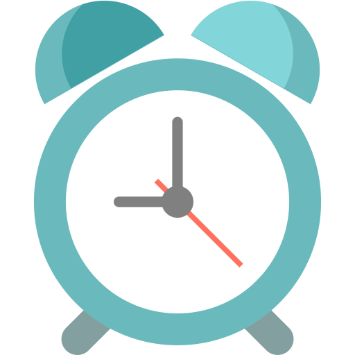

<!-- Improved compatibility of back to top link: See: https://github.com/othneildrew/Best-README-Template/pull/73 -->

<!--
*** Thanks for checking out the Best-README-Template. If you have a suggestion
*** that would make this better, please fork the repo and create a pull request
*** or simply open an issue with the tag "enhancement".
*** Don't forget to give the project a star!
*** Thanks again! Now go create something AMAZING! :D
-->

<!-- PROJECT LOGO -->
 

  

  <h3 align="center">Introduction</h3>

<!-- TABLE OF CONTENTS -->

  
Table of Contents

  <ol>
    <li><a href="#keyer">Keyer</a></li>
    <li><a href="#bytelist">ByteList</a></li>
    <li><a href="#index">Index</a></li>
    <li><a href="#storage">Storage</a></li>
    <li><a href="#serdes">SerDes</a></li>
  </ol>

## Event

In computing an **Event** is data with a time.
Minimal possible amount of data is "name".
Minimal possible amount of time is "when did it happened".

*Minimal event* is thus **NAME with TIMESTAMP**:

  - "Restart" at midnight
  - "Shootout" at high noon
  - "Birthday" at September 26, 1979, 5 min after midnight

Events are used to tell a story. Simple stories use simple events.
While some stories are simple, other require more work:

  - Debit card "Payment", 90€, in Zara, Madrid, yesterday at 14h

This event has more data to it than just name:

  - name: "Payment"
  - method: "debit card"
  - amount: "90"
  - currency: €
  - merchant: Zara
  - location: Madrid

Adding data to events is one way to tell more complex story.
It isn't the only way. Adding more time to event

  - "Fire", started at 13:31, ended at 15:40

Fires have **durations** - pairs of start and end timestamps.
Events often have durations. More than one:

  - "House fire", fire started 13:31,
                  fire alarm on 13:32,
                  firemen notified at 13:34,
                  firemen responed at 13:56,
                  fire alarm off 13:58,
                  fire extinguished 15:40

House, alarm, firemen - each of them has its own view of event,
own timeline of observing and reacting to it; and thus similar, but
not quite same story to tell about same fire.

Events do not exist in vacuum. They have **interested parties**.
When events are shared by multiple parties they have multiple
durations and all sorts of interesting correlations.

If you think abut it, at one level of abstraction, each episode of Poirot
is essentially retelling same event, from multiple observers.

We can always add more time and more data to event, but
question is when it is enough? Why do we do it?

Well events do not exist in vacuum. They have **interested parties**:

What else events have?

How about interested parties. They

And often, they have more than one observer:

(<a href="#readme-top">back to top</a>)

